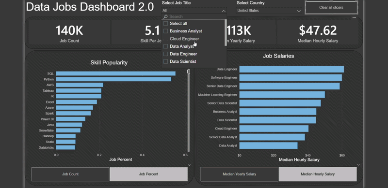
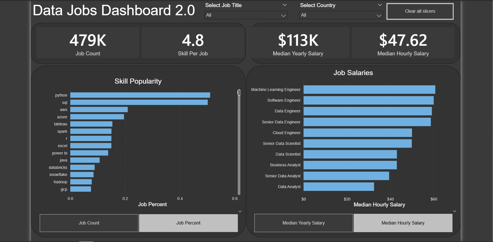

# Data Jobs Dashboard 2.0

## Introduction

This Power BI dashboard was created to help job seekers analyze the data job market and understand salary trends, skill demand, and role distribution.

The dataset contains real-world 2024 data job postings, including job titles, salaries, locations, and required skills. This dashboard transforms that data into a single interactive page for efficient market analysis.

---

## Power BI Skills Used

The following Power BI skills were utilized for this project:

- 📊 **Dashboard Design**
- ⚙️ **Power Query (ETL)**
- 🔗 **Data Modeling**
- 🧮 **DAX Measures**
- 📈 **Visualizations**
- 🖱️ **Interactive Features (Slicers, Buttons, Bookmarks)**

---

## Dashboard Build

### 🔢 KPI Cards
- Job Count  
- Skills Per Job  
- Median Yearly Salary  
- Median Hourly Salary  

### 📈 Skill Popularity
Displays most demanded skills with toggle between:
- Job Count  
- Job Percent  

### 💰 Salary Analysis
Compares median salaries across job roles with toggle between:
- Median Yearly Salary  
- Median Hourly Salary  

### 🎛 Interactive Controls
- Job Title Slicer  
- Country Slicer  
- Clear All Filters Button  
- Bookmark Navigation  

---

## Conclusion

This project demonstrates how Power BI can transform raw job posting data into structured insights. It highlights my ability to:

- Clean and model data  
- Build dynamic DAX calculations  
- Design user-focused dashboards  
- Deliver business-relevant insights  