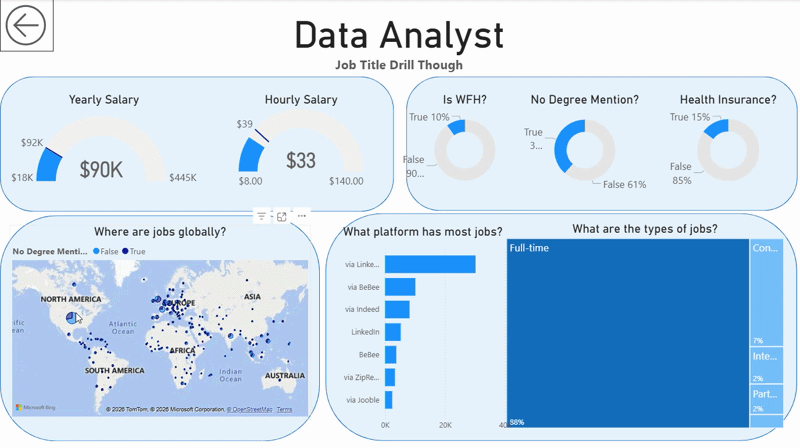

# 📊 Data Jobs Market Dashboard | Power BI

> An interactive Power BI dashboard analyzing salary trends, job distribution, and market insights across data-related roles.

---

## Introduction

This dashboard was built to help **job seekers and career transitioners** understand the evolving data job market.  

Using a dataset of 2024 data job postings (including job titles, salaries, locations, platforms, and job attributes), this project transforms raw data into an interactive and decision-ready analytics dashboard.

The goal was to provide a clear view of:

- Salary benchmarks  
- Job demand trends  
- Role distribution  
- Work-from-home availability  
- Platform-based hiring trends  

---

## 🛠 Skills Demonstrated

This project highlights practical Power BI and analytics skills:

- **⚙️ Data Transformation (Power Query / ETL)**  
  - Cleaned raw job posting data  
  - Handled missing values  
  - Standardized salary formats  
  - Created derived columns  

- **🧮 DAX Measures**  
  - Median Yearly Salary  
  - Median Hourly Salary  
  - Job Count  
  - Job Trend calculations  

- **📊 Core Visualizations**
  - KPI Cards
  - Line Chart (Job Trends in 2024)
  - Scatter Plot (Hourly vs Yearly Salary)
  - Bar Chart (Highest Paying Roles)
  - Table with mini-trend indicators

- **🗺️ Geospatial Analysis**
  - Global job distribution using map visualization

- **🖱️ Interactive Reporting**
  - Slicers for Job Title filtering
  - Drill-through functionality for role-specific deep dives
  - Back navigation buttons for improved UX

- **🎨 Dashboard Design & UX**
  - Clean layout structure
  - Consistent color palette
  - Executive-style summary section
  - Visual hierarchy for storytelling

---

## 📊 Dashboard Overview

This report contains two pages:

---

### 🔹 Page 1: High-Level Market View

This page provides a summary of the data job market:

- Total Job Count: **479K**
- Median Yearly Salary: **$113K**
- Median Hourly Salary: **$47.62**
- Salary comparison across job roles
- Monthly job trend analysis
- Salary relationship between hourly and yearly compensation

Key insight:
Machine Learning Engineers and Senior Data Scientists are among the highest paying roles.

---

### 🔹 Page 2: Job Title Drill-Through

This page allows users to drill into a specific job title (e.g., Data Analyst).

It includes:

- Salary distribution (Yearly & Hourly)
- Work-from-home availability
- No-degree requirement breakdown
- Health insurance coverage
- Global job location map
- Top hiring platforms
- Job type distribution (Full-time, Contract, etc.)

This feature demonstrates contextual analytics and user-driven exploration.

---

## 📈 Key Insights

- The majority of roles are full-time positions.
- Median yearly salaries cluster between $100K–$150K.
- Remote roles represent a smaller but significant portion of postings.
- Salary levels vary clearly across job categories.
- LinkedIn and major job boards dominate hiring platforms.

---

## 🚀 Project Outcome

This dashboard demonstrates the ability to:

- Transform raw job data into business insights
- Design interactive analytics experiences
- Apply DAX for KPI-driven analysis
- Build drill-through reporting workflows
- Communicate data findings visually and effectively

---

## 🧰 Tools Used

- Power BI  
- DAX  
- Power Query  
- Data Modeling  

---

